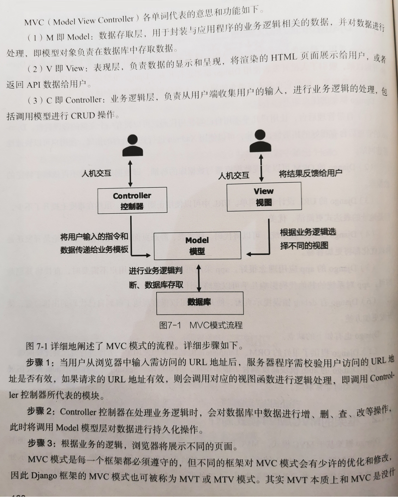

# Python

Python 是一个高层次的结合了解释性、编译性、互动性和面向对象的脚本语言。

Python 是一种解释型语言，Python 开发过程中没有编译环节，在这一点上，Python 类似于 PHP 和 Perl 语言。

Python 是交互式语言， Python 可以在控制台中直接输入代码语句，按 Enter 键就可以直接执行该代码，而无须经过保存和编译阶段。

Python 是面向对象语言，Python 支持面向对象的或代码封装在对象的编程技术。

Python 是以 C 语言为底层编写而成的，由于很多标准库和第三方库也是用 C 语言写的，来保证模块的运行效率，所以运行速度非常快。

Python 与 C、Java 使用相似的运算符，支持整数与浮点数的数学运算。同时，Python 还支持复数运算、无穷位数（实际受限于计算机能力）的整数运算。

Python 自带很多库，如文件操作、网络通信、GUI 编程、数据库处理等库。其中包含了大量的函数，使用者无须重复地编写某一类代码。除了这些内置的库外，Python 还支持更多的第三方库。

Python 的特点之一：依靠 Enter 键换行，以及通过缩进来判断代码段，所以在编写 Python 代码时不需要添加分号。

Life is Short, You need Python.

# Python 面向对象

在 Python 中，用变量表示特征，用函数表示技能，具有相同特征和技能的一类事物就是 “类”，对象则是这一类事物中具体的一个。

在 Python 中，所有数据类型都可以视为对象。用户也可自定义对象，自定义对象的数据类型就是面向对象中类（Class）的概念。

面向对象编程，其实就是对 “类”、“对象” 的使用。每个对象都可以接收其他对象发过来的消息，并处理这些消息，消息在各个对象之间传递，一起协同工作来完成复杂的功能。

类是用来生成对象的 “模板”，对象则是其所属类的 “实例”。

一个类实例化后就是一个对象。一个类必须经过实例化才能在程序中调用执行类中的函数。一个类可以实例化成多个对象，每个对象亦可以有不同的属性。

Python 的类提供了 “面向对象编程” 的所有标准特性，如封装、继承、重载等。

Python 通过 class 关键字来定义新的 “类（class）”。


# Python 快捷键

## Ctrl+/ 增加或解除注释

也可以在要注释的代码前面加上 “#” 来注释代码。


# 虚拟环境：venv 模块

Python 虚拟环境，将项目所需要的依赖包（指定版本）和环境变量，都打包成一个文件系统。不同的项目可以使用不同的虚拟环境，避免冲突。

虚拟环境的安装，将采用 virtualenv 命令。除此之外，还有其他技术方案可隔离不同的环境。例如 Anaconda、docker 镜像等。

用于创建与管理虚拟环境的模块为 virtualenv，可以通过 pip 包管理工具进行安装，安装命令：pip install virtualenv。


Python 3.4 之后的版本，默认自带了创建和管理虚拟环境的模块 venv（PEP405），通过 venv 模块，也可以很方便地创建和管理虚拟环境。


## Windows 下的虚拟环境搭建

```bash
# 打开一个 cmd 命令窗口，输入安装 virtualenv 的命令
pip3 intall virtualenv

# 查看 virtualenv 的帮助文档。输入命令：
	# 其中，-p 参数：用来指定安装的虚拟环境中的 Python 版本。
	# --no-site-packages 参数：用来确保安装的虚拟环境，不会有已经安装过的包文件。
virtualenv --help

# 使用 virtualenv 命令，进行虚拟环境的创建。例如，在 E 盘下，创建纯净的虚拟环境 env，安装 Python 3.7 版本
virtualenv --no-site-packages -p D:\python3\python.exe env

# 虚拟环境的激活：在虚拟环境 “env/Scripts” 文件夹，执行 activate 命令，即可激活。且在激活状态中，使用 pip 安装的库都将安装在当前激活的虚拟环境中。
activate

# 虚拟环境的退出：在虚拟环境 “env/Scripts” 文件夹，执行 deactivate 命令，即可退出当前虚拟环境。
deactiveate

```


## Linux 下的虚拟环境搭建

```bash
# 以 CentOS 7 系统为例，安装 virtualenv。打开一个新的终端，输入命令
yum intall python-virtualenv


# 创建指定 Python3 （如 Python 3.7）、纯净的虚拟环境 env。其中，env 为虚拟环境的名称。
virtualenv --no-site-packages -p /usr/local/python3/bin/python3 env

# env 虚拟环境的激活，在终端输入命令
source env/bin/activate

# env 虚拟环境的退出，在终端输入命令
deactiveate

```


## venv 模块创建和管理虚拟环境

通过 virtualenv 命令和  python -m venv 命令搭建的虚拟环境，并没有任何区别。

只是 python -m venv 命令创建虚拟环境，只限于 Python 3 版本。

而 virtualenv 命令创建虚拟环境，则不限版本。

```bash
# 创建虚拟环境之前，先确认放置虚拟环境的位置，例如，在【CMD 命令提示符】窗口中，进入放置虚拟环境的目录（E:\env）

# 创建虚拟环境：在 Windows、Linux、Mac 操作系统中，均可输入下面命令来创建虚拟环境。
python -m venv testenv

# 激活虚拟环境
	# Windows 下，激活虚拟环境命令：
testenv\Scripts\activate

	# Linux 下，激活虚拟环境命令：
source testenv\Scripts\activate

	# Mac 下，激活虚拟环境命令：
source testenv\Scripts\activate

# 退出虚拟环境：在 Windows、Linux、Mac 操作系统中，均可输入下面命令来退出虚拟环境。
deactiveate

```

## PyCharm IDE 中，虚拟环境的配置

1.启动 PyCharm IDE 社区版。

2.在导航栏上，选择【File】--> 【Setting】-->【Project Interpreter】，配置当前项目所依赖的虚拟环境。

3.检验虚拟环境是否配置成功。单击 PyCharm 底部的【Terminal】按钮，检查弹出框中出现提示：（虚拟环境名称）路径。

# Anaconda

Anaconda 是一个开源的包和环境的管理器，用于在同一台机器上管理不同版本的软件包及其依赖，并能够在不同的环境之间切换。

在 Anaconda 中，新建 TensorFlow + Python（指定的版本）的环境进行学习。

# Python IDE


## IDE：IDLE

IDLE（Integrated Development and Learning Environment，集成开发与学习环境），是 Python 官方发行版带有一个简单 IDE。

IDLE 就是一个用 Python 编写的程序。

## IDE：Spyder

Spyder 同样是 Python 编写的科学 Python 开发环境，Spyder 为免费的开源软件。

Spyder 是基于 PyQt5 开发的。

数据科学专用发行版 Anaconda 中就集成了 Spyder。


## IDE：PyCharm

PyCharm 是一种 Python IDE，包含一整套的开发工具，如调试、语法高亮、Project 管理、代码跳转、智能提示、自动完成、单元测试、版本控制等。

PyCharm 是用 Java 语言编写的，功能列为全面和完善，同时界面也更为复杂。

PyCharm 还提供了一些高级功能，用于支持 Django 框架下的专业 Web 开发。


## IDE：Visual Studio

Visual Studio 是一个非常强大的专业 IDE。


# Python 常用的内置模块

## os 模块

用于提供系统级别的操作（文件和目录）。

## sys 模块

用于提供对解释器的相关操作

## time 和 datetime 模块

用于提供与时间相关的操作

```python
# 使用内置模块输出系统当前的时间，在交互模式下输入代码:
>>> import datetime
>>> nowTime = datetime.datetime.now().strftime('%Y-%m-%d %H:%M:%S')
>>> print(nowTime)
2021-01-07 17:25:00
```


## random 模块

提供产生随机数的操作

## logging 模块

用于便捷地记录日志和线程安全的模块

## math 和 cmath 模块

math 模块用于实数运算。

cmath 模块用于复数运算。

## json 和 pickle 模块

用于数据传输的数据类型模块

## shutil 模块

高级的文件、文件夹、压缩包的处理模块（递归、文件复制等）

## tkinter 模块

tkinter（Tk interface 的缩写）是 Python 标准库自带的 GUI 工具包。tkinter 的特点是简单轻便，可以用于在不同系统平台上快速开发风格一致的基本 GUI 程序。IDLE 和 turtle 都是基于 tkinter 实现的。

Tk（又称 Tcl/Tk），是一种通用的跨平台 GUI 工具库。tkinter 是 Python 对这个 GUI 工具库的封装。


# Python 第三方库的使用

## NumPy （Numerical Python）

NumPy 是 Python 的一个开源数值计算扩展工具包，其支持大量的维度数组与矩阵运算，针对数组运算提供了大量的数学函数库。具有强大的 N 维数组对象 ndarray，广播功能函数，整合 C、C++、Fortran 代码的工具。

另外，还包括傅立叶变换、随机数生成等功能。

## Pandas

Pandas  是一个开源的、BSP 许可的库，同样是 Python 的一个数据分析工具包。Pandas 是基于 NumPy 库，为 Python 编程语言提供高性能、易于使用的数据结构和数据分析工具。

创建此工具包的目的：为了解决数据分析任务，更有效地支持时间序列分析。

## SciPy

SciPy 是一个用于数学、科学、工程领域的常用软件包，可以处理插值、积分、优化、图像处理、常微分方程数值的求解、信号处理等问题。

SciPy 用于有效计算 NumPy 矩阵，使 NumPy 和 SciPy 协同工作，高效解决问题。

## Matplotlib

Matplotlib 是 Python 的绘图库，它可与 NumPy 一起使用，提供了一种有效的 MATLAB 开源替代方案。也可和图形工具包一起使用，如 PyQt 和 wxPython。

Matplotlib 中最重要的功能 plot，它可以绘制二维数据。

## Seaborn

Seaborn 是一个以 Matplotlib 为基础的图形可视化 Python 包，提供了一种高度交互式界面，便于用户做出各种有吸引力的统计图表。

Seaborn 是以 Matplotlib 为基础进行更高级的 API 封装的，使作图变得更加容易、做出更具吸引力的图。

Seaborn 能高度兼容 NumPy 与 Pandas 数据结构，以及 SciPy 与 Statsmodels 等统计模式。

# PyQt5 图形界面工具包（第三方库）

PyQt5 是 Python 中最常用的 GUI 工具包，提供了对于通用桌面应用程序开发框架 Qt 的 Python 接口。

相比 tkinter（标准库自带 GUI 库），PyQt5 包包含更多可视化部件，并具有更现代化的外观。

Qt 是使用 C++ 语言编写的跨平台桌面应用程序开发框架。实际上目前存在 2 个 Qt 的 Python 接口工具包—— PyQt5 和 PySide2。相比，PyQt5 更成熟稳定一些。


# ■■■■■■■■■■■■■■■■■■■■■■■■■■■■■■■■■■■■■■■■■■■■

# 网络爬虫

## 网络爬虫：Excel

Excel 软件也可以爬虫，Excel 在数据面板集成了 PowerQuery 功能，提供了从网站获取数据的菜单。

Excel 将该模块全部菜单可视化，只需要在输入栏里面填入网站的地址参数，就可以完成数据的获取，自动存入到 Excel 表格。

获取到的数据后，就可以对数据进行统计分析、制图、以及可视化展示。

但是当爬取的数据量很大时，受限于本身的容量限制和存储技术需求，Excel 就不再适用，此时就需要新的工具来解决这类爬虫需求，Python 就是最佳选择之一。

## 网络爬虫：Python

网络爬虫领域的应用，使用的第三方爬虫库，包括：requests、beautifulsoup、scrapy、seleninum、re 等。

在获取到数据之后，还需要继续引入第三方库，完成对数据的后续存储、分析、可视化等。

例如，数据的存储可以选用自带的 sqlite 库，或者使用 pymsql 来操作远程的 MySQL 数据库，或者存入到 Excel。

- 还可直接在 Python 中编程来操作 Excel。例如，第三方库 xlsxwriter 已经将许多 Excel 操作内置成了方法和对象，可以使用 Python 来创建 Excel表、读取 Excel 表内容、以及其他操作。

数据的处理和分析可以选用数据科学专用库 numpy、pandas。

数据的可视化可以选择 matplotlib、或者 pyecharts。

如果想实现可视化菜单操作，还可以选择 Tkinter 或者 pyQT 第三方库来制作爬虫可视化界面。

如果数据量非常大，可以通过使用进程管理将数据爬取下来，然后使用 HDFS 分布式文件系统实现存储。


## 网络爬虫框架：PySpider

标准库的 urlib 模块也是网络爬虫框架。

PySpider 网络爬虫框架为 Python 第三方库，它提供了现成的模板代码和 Web 管理界面，可以快速创建网络爬虫。

PySpider 支持多种不同的数据库引擎。PySpider 默认使用 SQLite 来存储各类数据。SQLite 是一种流行的轻量级文件型数据库引擎，每个数据库对应一个 .db 文件。用户可以在 VS Code 中安装 SQLite 扩展插件，以便直接操作SQLite 数据库。

PySpider 也可以选择更强大的服务器型数据库引擎，例如 MySQL、MongoDB 等。

# ■■■■■■■■■■■■■■■■■■■■■■■■■■■■■■■■■■■■■■■■■■■■

# Web 开发——主流框架：Django

Python Web 框架是一种快速开发系统的应用，包括简单的博客系统、客户关系管理系统（CRM）、内容管理系统（CMS）、企业资源管理系统（ERP）等。

Django 是一个大而全的重量级框架，也是最具代表性的框架之一。许多网站的后端，都是基于 Django 框架进行开发的，Django 框架在快速开发中，有着绝对的优势。

Django 采用最典型的 MVC 模式。

MVC 模式（Model View Controller）是模型-视图-控制器的缩写。

- MVC 是一种软件设计典范，用业务逻辑、数据和界面显示分离的方法来组织代码，将业务逻辑聚集到一个部件里面。

- 在改进和个性化定制界面及用户交互时，不需要再重新编写业务逻辑。

- MVC 的核心思想就是解耦，减低各个模块之间的耦合性。

- MVC 多用于映射传统的输入、处理、输出功能，让其在一个逻辑的图形化用户界面的结构中呈现。即强制性地使应用程序的输入、处理、输出分开。

  


# Web 开发——微框架：Flask

Flask 是小型框架，也被称作 “微框架”。在 Python 众多优秀 Web 框架中，Flask 框架非常受允迎。

Flask 框架通过在基本核心模块 Flask 之上添加扩展模块，来实现更复杂的功能。例如，分页功能模块 flask_paginate。

PySpider 的 Web 管理界面就是用 Flask 开发的。

Flask 的 Web 项目，并不像 Django 项目那样需要使用命令行进行创建，而是直接创建一个名为 HelloWorld.py 文件即可。

## 最简单的 Flask 项目

创建一个文件名为 HelloWorld.py 文件，在 HelloWorld.py 文件编写代码。

```python
from flask import Flask

# 初始化一个 Flask 对象。导入 Flask 类，并实例化。Flask 类的构造函数唯一需要的参数就是应用程序的主模块名或包的名称。
app = Flask(__name__)

# 定义路由，绑定视图函数
@app.route('/')
def hello_world():
    return 'Hello World!'

# 在此使用 __name__ == '__main__' 是为了确保 Web 服务，只有在直接运行时才会执行 app.run() 方法。如果当前文件被另外一个语言件导入，那么当前文件的 app.run() 方法，就会被跳过。
if __name__ == '__main__'
	# 启动
    app.run()
```


# Web 开发——高并发框架：Tornado

Tornado 是使用 Python 语言编写的一个轻量级的 Web 框架，具备异步、非阻塞的能力，不但可以支撑上万的并发连接，还支持长连接、WebSockets 、其他要求实时长连接等应用，以及提供网站开发的 API 接口。内置高性能 HTTP 服务器。

Tornado 框架主要用于处理日趋严峻的高并发问题，Tornado 在创建、扩展、部署中都非常优秀。

得益于其非阻塞的方式和对 epoll 函数的运用，Tornado 可以处理数以千计的连接，是理想的实时通信 Web 框架。如果需要编写一个可扩展的应用、RESTfull API、异步，那么 Tornado  框架是首选。

在 Tornado 的异步库中，最常用的类对象，就是自带的 AsyncHTTPClicen，它可以执行异步非阻塞的 HTTP 请求。

Tornado 的安全 Cookie 使用加密签名来校验 Cookie 中的信息是否被篡改。若有人恶意篡改 Cookie 中的内容，由于对方并不知道安全密钥，因此无法对 Cookie 进行修改，保证 Cookie 的安全。

## 最简单的 Tornado 项目

创建一个文件名为 HelloWorld.py 文件，在 HelloWorld.py 文件编写代码。

```python
import tornado.ioloop
import tornado.web

class MainHandler(tornado.web.RequestHandler):
    def get(self):
        self.write("Hello, World!")

def make_app():
    return tornado.web.Application(handlers=[
        (r"/hello", MainHandler),
    ])

if __name__ == "__main__"
	app = make_app()
    app.listen(8888)
    tornado.ioloop.IOLoop.current().start()
    
```


# Web 开发——底层框架：Twisted

Twisted 是一个事件驱动的网络引擎框架，事件驱动编程模式在 Twisted 的设计中占据重要的位置。

底层框架 Twisted 是用 Python 实现的，基于事件驱动的网络框架，它诞生于 21 世纪初。

在 Twisted 中，事件的驱动体现在 reactor（反应堆）的事件循环内，当外部事件发生时，使用回调机制来触发相关的业务逻辑。

Twisted 框架中 3 个基础模块：

- Reactor 模块
  - Twisted 的核心是 reactor 事件循环，reactor 表示事件发生后，立即做出相应的响应。
- Transports 模块
  - Transports 代表网络中两个通信节点之间的连接。一个 Transports 模块代表一个可以接收或发送字节的单条连接。
  - Transports 连接可以面向流模式（如 TCP），也可以面向数据报文模式（UDP、Unix sockets）,IMAP 等。
- Protocols 模块
  - Protocols 模块描述了如何以异步的形式处理网络中的事件。 Protocol 对象用来实现协议内容。


## 最简单的 Twisted Web 项目（Web Server）

创建一个文件名为 HelloWorld.py 文件，在 HelloWorld.py 文件编写代码。

```python
from twisted.web improt server, resource
from twisted.internet import reactor


class Simple(resource.Resource):
    # isLeaf 描述资源是否有子资源
    # 如果 isLeaf 设置为 False，则访问任务 URL 都将是 404 (No Such Resource 错误提示页面)
    isLeaf = True
    
    # 定义使用 render_method 方法来接收每一个 HTTP 请求
    # 如 render_GET 方法，用于处理 HTTP GET 请求
    # 如 render_POST 方法，用于处理 HTTP POST 请求
    def render_GET(self, request):
        return b"Hello, World!"

site = server.Site(Simple())
reactor.listenTCP(8080, site)
reactor.run()
    
```

